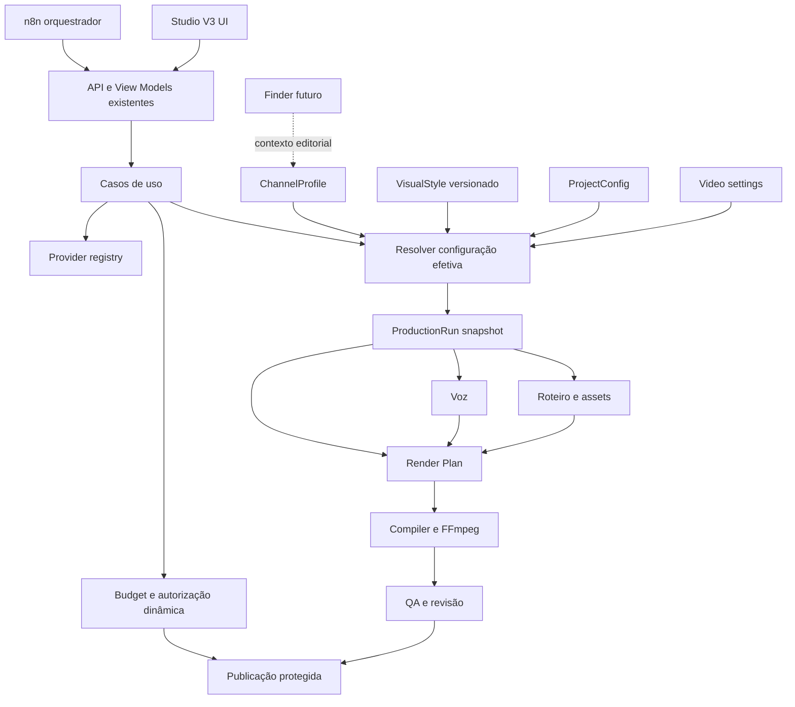

# Arquitetura alvo

Diagrama conceitual da arquitetura alvo, não uma representação de implementação já validada. Nomes de estados e contratos devem ser reconciliados no HEAD.

```mermaid
flowchart TB
  UI[Studio V3 UI] --> API[API e View Models existentes]
  N8[n8n orquestrador] --> API
  API --> UC[Casos de uso]
  UC --> RES[Resolver configuração efetiva]
  CP[ChannelProfile] --> RES
  VS[VisualStyle versionado] --> RES
  PC[ProjectConfig] --> RES
  VD[Video settings] --> RES
  RES --> RUN[ProductionRun snapshot]
  RUN --> SCRIPT[Roteiro e assets]
  RUN --> VOICE[Voz]
  SCRIPT --> PLAN[Render Plan]
  VOICE --> PLAN
  RUN --> PLAN
  PLAN --> FF[Compiler e FFmpeg]
  FF --> QA[QA e revisão]
  QA --> PUB[Publicação protegida]
  UC --> SAFE[Budget e autorização dinâmica]
  SAFE --> PUB
  UC --> REG[Provider registry]
  FI[Finder futuro] -. contexto editorial .-> CP
```
